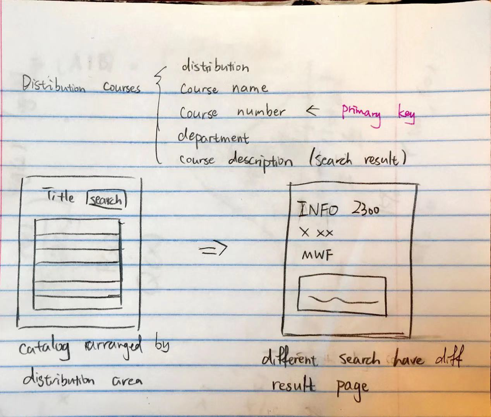
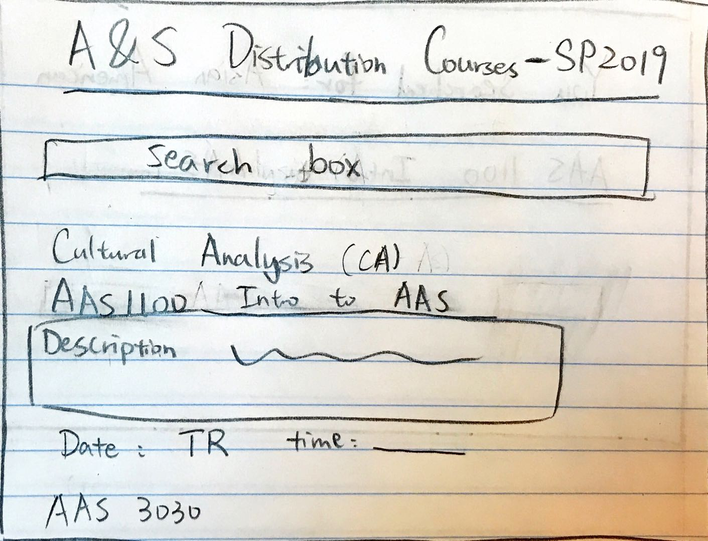
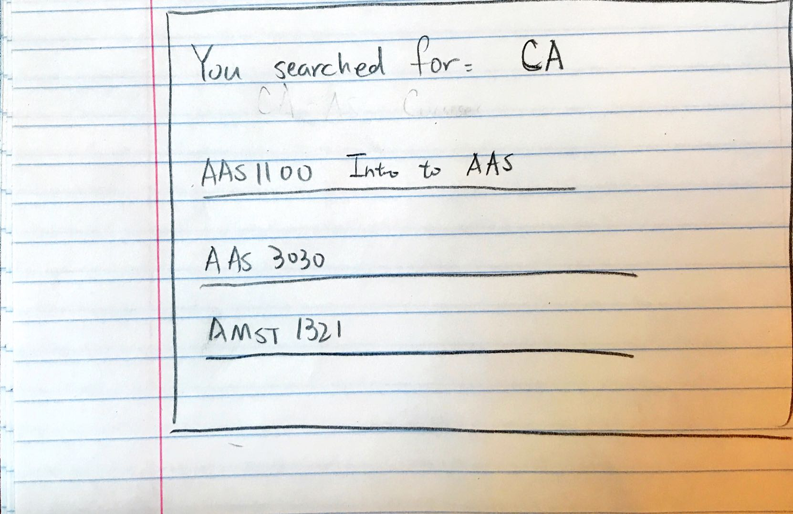
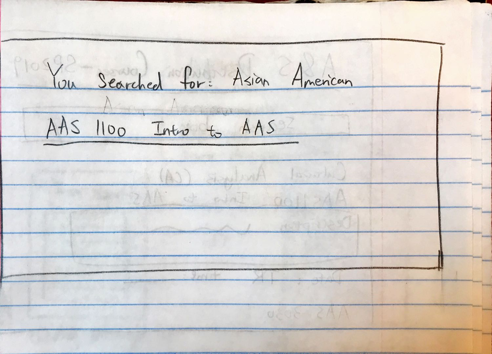
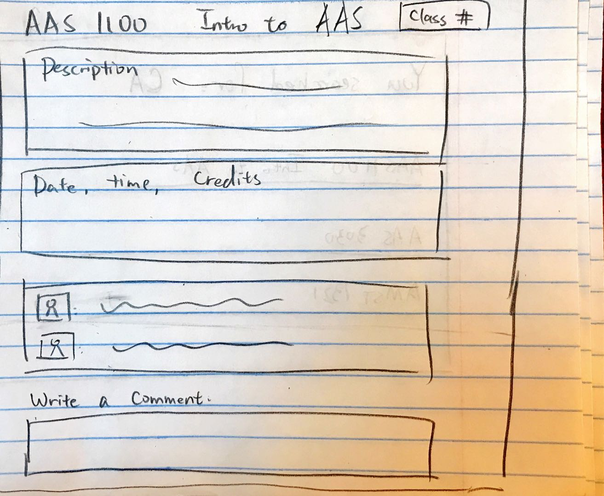

# Project 2: Design Journey

Your Name: [insert your name here]

**All images must be visible in Markdown Preview. No credit will be provided for images in your repository that are not properly linked in Markdown. Assume all file paths are case sensitive!**

# Project 2, Milestone 1 - Design, Plan, & Draft Website

## Describe your Catalog

[What will your collection be about? What types of attributes will you keep track of for the *things* in your collection? 1-2 sentences.]

It is a collection of courses that can fulfill humanities distribution requirements for the College of Arts and Sciences, offered in Spring 2019 term.
The attributes are: class number, course name, department, distribution area, and comments.

## Target Audiences

[Tell us about your target audience(s).]

My target audeince is Cornell College of Arts and Sciences students looking for courses to fulfill their humanities distribution requirements. These students do not have a particular course in mind, and they are looking for potentially interesting courses that can fit into their schedule while fulfilling distribution requirement at the same time. They can search for these courses based on what they care about the most, such as distribution area, department or course title. They can also see the comments of students on this course to help their decision.

## Design Process

[Document your design process. Show us the evolution of your design from your first idea (sketch) to design you wish to implement (sketch). Show us the process you used to organize content and plan the navigation (card sorting).]

[Label all images. All labels must be visible in Markdown Preview.]

Card Sorting and Initial Sketch

[Include sketches of your final design here.]

Home/Full catalog page

Search by Distribution Area page

Search by Title page

Course Description page

## Final Design Plan

Due to time and other constraints, I had to give up the description page for each course, and the insert comment function can only add reviews to courses not currently listed.

## Templates

[Identify the templates you will use on your site.]

Title on each page
The table heading for each section when displaying all courses

## Database Schema Design

[Describe the structure of your database. You may use words or a picture. A bulleted list is probably the simplest way to do this. Make sure you include constraints for each field.]

Table: courses
* field 1: id, (class number), integer, not null, unique
* field 2: course title, text, not null, unique
* field 3: department, text, not null
* field 4: distribution, text, not null
* field 5: comments, text, no constraints

## Database Query Plan

[Plan your database queries. You may use natural language, pseudocode, or SQL.]

1. All records
select all records from the database
SELECT * FROM courses

2. Search records
The search options of department, distribution and class time will be given in a drop-down menu, and search and output in the corresbonding field.

Course title will be searched by key words, output all titles that include the key word.

Class number will be searched by inputting numbers, but the number have to be exactly the same.

3. Insert record
Students can insert a review to course not listed in the catalog.

## Code Planning

[Plan any PHP code you'll need here.]

# Final Submission: Complete & Polished Website

## Reflection

[Take this time to reflect on what you learned during this assignment. How have you improved since Project 1? What things did you have trouble with?]

I initially planned too much data/work that I could not finish and implement in the end. I did not choose a good dataset and website structure for this project.
